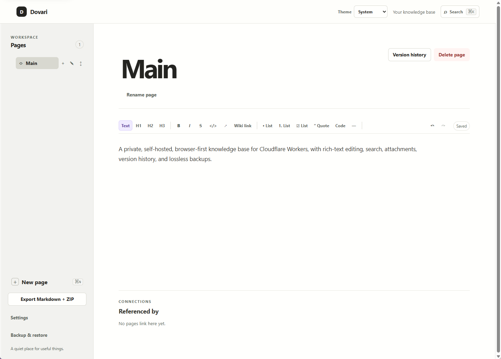
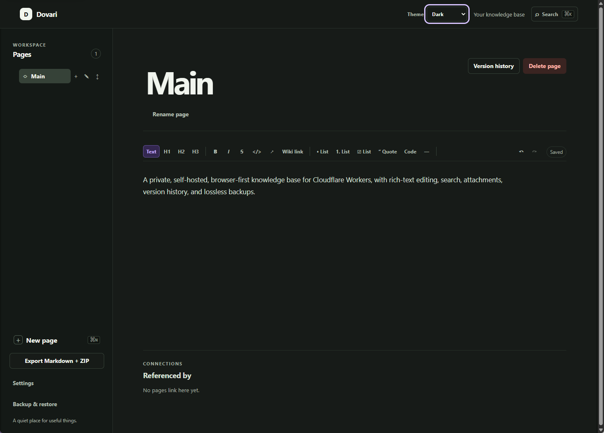

# Dovari

[](https://github.com/kuranai/dovari/actions/workflows/ci.yml)
[](https://deploy.workers.cloudflare.com/?url=https://github.com/kuranai/dovari)

Dovari is a browser-first knowledge base that you host in your own Cloudflare account. It combines
a fast, document-style editor with page hierarchy, search, file attachments, version history,
lossless backups, and an owner-controlled public reading area. A single deployment runs the React
application and its API, while your structured data and private assets remain in Cloudflare D1 and
R2.

Dovari is designed for individuals who want a focused personal workspace without operating a
traditional server or handing their notes to a hosted knowledge-base provider.

## Features

- Write immediately in a rich-text editor with headings, lists, checklists, code blocks, links,
  Wiki Links, and backlinks.
- Organize pages in a hierarchy and find them through full-text search or the command palette.
- Paste screenshots and drag files directly into a document.
- Recover deleted pages and restore earlier revisions.
- Export Markdown and attachments, or create a complete backup for lossless restore.
- Publish selected pages as read-only public snapshots while keeping drafts and private metadata hidden.
- Use a responsive, keyboard-accessible interface with light and dark themes.
- Deploy the complete application to Cloudflare Workers with D1 and a private R2 bucket.

## Screenshots




## Getting started

### Deploy to Cloudflare

The quickest way to run Dovari is with the deployment button at the top of this page.

1. Sign in to Cloudflare and select your account.
2. Set `DOVARI_PASSWORD` to a private password of at most 256 UTF-8 bytes.
3. Keep the default Worker, D1 database, and R2 bucket names, or choose unused names if they
   already exist in your account.
4. Wait for the deployment to finish, then open the generated `workers.dev` address.

Cloudflare provisions the required bindings and stores the password as an encrypted Worker
secret. No external identity provider or public R2 bucket is required.

### Run locally

Requirements:

- Node.js 26 or newer
- npm 11 or newer

```sh
git clone https://github.com/kuranai/dovari.git
cd dovari
npm ci
cp .dev.vars.example .dev.vars
```

Replace the example value in `.dev.vars` with a `DOVARI_PASSWORD` of at most 256 UTF-8 bytes, then
initialize the local database and start the application:

```sh
npm run db:migrate:local
npm run dev
```

Open the URL shown by Vite, usually `http://localhost:5173`, and sign in with that password.
Wrangler keeps local D1 and R2 data separate from production.

## Using Dovari

The site root `/` shows the pages that the owner has explicitly published. Public readers can search
published titles and snapshot content from `/` or the public page navigation; published hierarchy
skips unpublished intermediate pages. Open `/app` to enter the private workspace, where you can
create and edit pages with **New page** or `Ctrl/Cmd+N`; Dovari saves changes automatically. Type
`/` in an empty paragraph to open the command menu, or use `Ctrl/Cmd+K` to search and navigate.

Public pages default to `noindex`. Only publications explicitly marked as indexable appear in
`/sitemap.xml` and the matching `Allow` entries in `/robots.txt`. Republish and unpublish changes
are revalidated immediately through versioned public responses.

Settings contains recent pages, the Trash, version history, theme controls, and backup and restore.
The sidebar also provides a Markdown and ZIP export for use outside Dovari.

## Architecture

Dovari keeps the deployment deliberately small:

| Layer                      | Technology                     |
| -------------------------- | ------------------------------ |
| Web application            | React, Vite, and Tiptap        |
| API                        | Hono on Cloudflare Workers     |
| Structured data and search | Cloudflare D1 with SQLite FTS5 |
| Private files              | Cloudflare R2                  |
| Schema and validation      | Drizzle ORM and Zod            |

The Worker serves both the application and API. R2 objects are never made public; authenticated
requests retrieve files through the Worker.

## Data, backup, and restore

The full v2 backup available in Settings includes active and deleted pages, hierarchy, revisions,
publications, Wiki Links, and all assets. Dovari verifies asset sizes and SHA-256 checksums during
restore; v1 backups remain importable. For safety, a full backup can only be restored into an empty
workspace.

Deploying a new Worker version invalidates existing sessions. Changing `DOVARI_PASSWORD` therefore
signs out every device.

## Development

Run the complete local quality gate with:

```sh
npm run ci
```

This checks formatting, linting, types, Worker and client tests, and the production build. To run
the browser suite, install Chromium once and start the tests:

```sh
npx playwright install chromium
npm run test:e2e
```

To preview the production-shaped Worker locally:

```sh
npm run build
npm run preview
```

The repository's [technical specification](TECHNICAL_SPEC.md) contains the detailed architecture,
API, data model, security constraints, and test strategy.

## CLI deployment

For an existing checkout, authenticate Wrangler and deploy with:

```sh
npm ci
npx wrangler login
npx wrangler secret put DOVARI_PASSWORD
npm run deploy
```

The deployment runner builds the application, provisions or connects the configured D1 and R2
resources, applies pending migrations, and deploys the Worker. Validate the production artifact
without changing Cloudflare resources with `npm run deploy:dry-run`.

This installation already uses `kuranai.com` as its custom hostname. The deployment-specific
Cloudflare configuration is kept in `wrangler.jsonc` and must not be replaced with the generic
Dovari source configuration.

## Automatic upstream synchronization

This repository is the `kuranai.com` deployment instance of Dovari. The daily GitHub Actions
workflow imports new application changes from [`kuranai/dovari`](https://github.com/kuranai/dovari),
keeps the local Cloudflare resources, runs the quality gates, and deploys the tested Worker. See
the [upstream synchronization guide](docs/UPSTREAM-SYNC.md) for the required GitHub secrets and
the manual command.

## Security model and current limitations

Dovari is intended for one owner or a small trusted group sharing one instance password. It does
not provide individual accounts, password reset, MFA, roles, or comments. The owner can explicitly
publish read-only snapshots; private APIs and editing require an authenticated session, browser
mutations require a matching same-origin `Origin` header, and asset storage remains private behind
the Worker.

The application is not a substitute for an identity platform when separate user accounts or
fine-grained access control are required.

## Contributing

Issues and pull requests are welcome. For a substantial change, open an issue first so the
approach can be discussed before implementation. Please run `npm run ci` and the relevant browser
tests before submitting a pull request.

## License

Dovari is available under the [MIT License](LICENSE).
